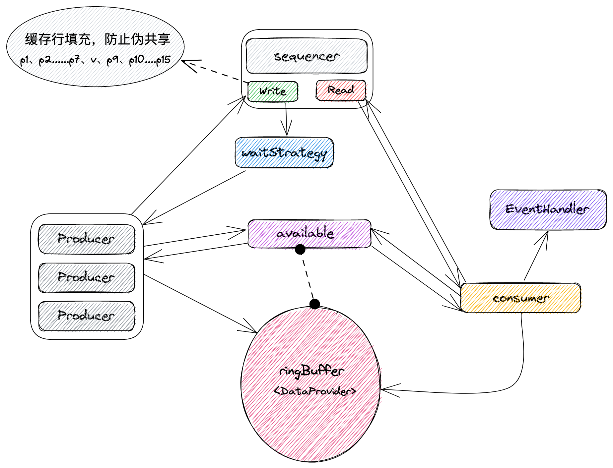
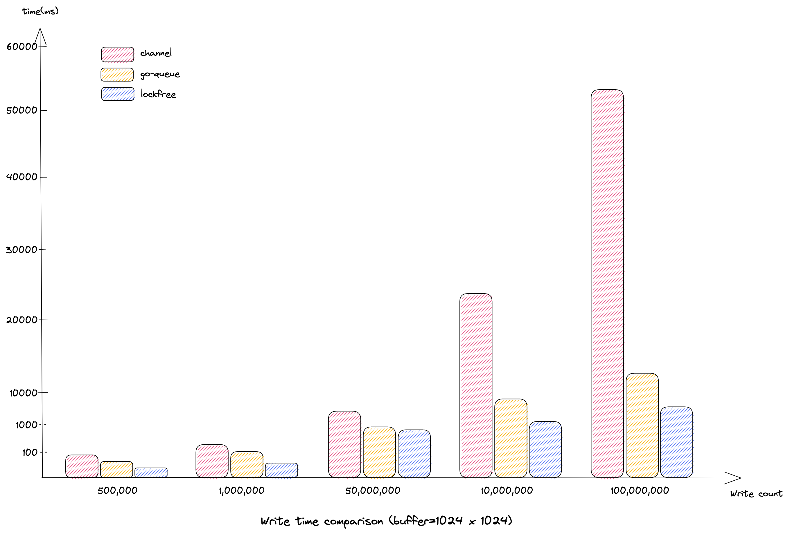

## Disruptor

### 1. 简介
#### 1.1. 为什么要写Disruptor
在go语言中一般都是使用chan作为消息传递的队列，但在实际高并发的环境下使用发现chan存在严重的性能问题，其直接表现就是将对象放入到chan中时会特别耗时，
即使chan的容量尚未打满，在严重时甚至会产生几百ms还无法放入到chan中的情况。

经过源码的查看，chan实际对应的结构是`runtime.hchan`，其结构中包含了一个lock字段：`lock mutex`。
这个lock看名字就知道是一个锁，当然它不是我们业务中经常使用的sync.Mutex，而是一个`runtime.mutex`。
这个锁是一个互斥锁，在linux系统中它的实现是futex，在没有竞争的情况下，会退化成为一个自旋操作，速度非常快，但是当竞争比较大时，它就会在内核中休眠。
注意，此处是在内核中休眠，而与runtime.Mutex不同，后者其实是通过gopark()方式将当前g调度出去了，从P中换了一个其他g执行。
因此，当竞争比较大时，chan的性能是比较低的，很难支持对性能要求比较高的业务。

#### 1.2. go-disruptor
众所众知，在java中有一个比较出名的高性能无锁队列：Disruptor。虽然在go中也有一个，但是经过实际测试，发现其性能很一般，并且不支持并发写入。
因此就萌生了go语言版本的Disruptor想法。

补充一个对比的go无锁队列：https://github.com/yireyun/go-queue go-queue的性能也是比较高的（后面有性能对比），
但go-queue的写法对于我这种有洁癖的来人说实在是感觉不舒服（需要手动实现for循环写入）。

在实际编写时参考了Disruptor的很多想法，整体而言，该库有以下几个特点：

##### 1）绝对的无锁实现：

lockfree内部几乎所有的操作都是通过**原子变量(atomic)**来操作，仅仅有一处使用了chan，作为队列长时间为空时，消费g阻塞使用，该chan只有在队列为空的情况下触发，所以不会影响性能。

##### 2）单一的消费g：

消费g即队列的消费者，**将消费g设置为单一g**，即整个无锁队列只有一个g用于消费，这样就屏蔽掉了读操作竞争带来的性能损耗。

##### 3）写不等待原则：

本身无锁队列的设计初衷就是写入要快，因此对于写入的操作是不会等待的，当无法写入时会持续通过自旋加任务调度的方式处理，一方面尽量加快写入效率，另一方面则是防止占用太多CPU资源。其核心处理代码：

```go
  // 获取下一个可写入序号  
  seq := q.seqer.next()
	pos := int(seq & q.mask)
	for {
		if q.abuf.disabled(pos) {
			q.rbuf.write(pos, v)
			q.abuf.enable(pos)
			// 如果接收方阻塞则释放
			q.abuf.release()
			break
		}
		// 写操作持续等待，该等待仅会调用runtime.Gosched()进行当前g的调度让出
		loop, _ = wait(loop, WriteWaitMax)
	}
```

##### 4）Pointer替代切片：

available切片用于标记ringbuffer中元素的可用状态。尽管其是一个[]uint8结构，但实际上当高并发对其进行赋值更新时，由于每次操作在其内部都会进行越界判断（通过汇编代码获得该信息），导致其寻址性能并不高。因此通过对切片结构中的Data进行unsafe.Pointer操作，提高了其可用状态调整的性能。

```go
// enable 设置pos位置为可读状态，读线程可读取
func (a *available) enable(pos int) {
	*(*uint8)(unsafe.Pointer(uintptr(a.buf) + uintptr(pos))) = 1
}

// disable 设置pos位置为可写状态，写入线程可写入值
func (a *available) disable(pos int) {
	*(*uint8)(unsafe.Pointer(uintptr(a.buf) + uintptr(pos))) = 0
}
```


##### 5）一次性内存分配：

使用环状结构Ringbuffer实现对象的传递，RingBuffer中存储对象为包含传递对象结构的结构体，可以进行一次性内存分配，提高处理的性能。

##### 6）缓存行填充：

在计算机硬件上，为了提高效率，cpu存在多级高速缓存（通常是三级）。指令和数据会被事先加载到多级缓存中，这样cpu就不用每次与内存进行交互，从而提高效率。然而实际上不会只加载需要的数据，而是会加载需要数据的上文部分数据，因为根据程序的局部性原理，这些数据后面大概率会用到，这样就避免了再次加载，提高了效率。但是如果这样一次性加载的数据如果被多个cpu核心操作，就会涉及到一个竞争，因此每次加载和更新的数据是有冲突的（从应用程序上来看是没有冲突的），这就形成了所谓的伪共享。解决这个问题的办法就是缓存行填充，操作系统一般一次性加载的缓存行大小是64B，因此可以在其前和后各加入部分字段来解决。数据结构如下：

```go
// cursor 游标，一直持续增长的一个uint64序列
// 该序列用于wg（Write Goroutine）获取对应写入到buffer中元素的位置操作
// 通过使用atomic操作避免锁，提高性能
// 通过使用padding填充的方式，填充前面和后面各使用7个uint64（缓存行填充），避免伪共享问题
type cursor struct {
	p1, p2, p3, p4, p5, p6, p7       uint64
	v                                uint64
	p9, p10, p11, p12, p13, p14, p15 uint64
}
```

##### 7）与运算加速：

RingBuffer的容量必须设置为2的n次方，这样就可以通过与运算来代替取余运算，从而提高整体的性能。

##### 8）泛型加速：

Go1.18版本后引入了泛型，泛型与interface有很明显的区别，从性能上来看，泛型是在编译阶段确定类型，这样可有效降低在运行时进行类型转换的耗时（经过测试，这部分还是比较耗时的）。

### 2. 核心概念
整体的disruptor模型如下所示：


##### ringBuffer
具体对象的存放区域，通过数组（定长切片）实现环状数据结构，其中的数据对象是具体的结构体而非指针，这样可以一次性进行内存申请。

##### available
切片实现的map，通过index（或pos）标识每个位置为0或1，当长时间无法读取时会通过blockC进行阻塞，写线程完成时可释放该blockC。
其内部buf实际是[]uint8，但由于[]uint8切片在寻址时会进行游标是否越界的判断，造成性能下降，因此通过使用unsafe.Pointer直接对对应的值进行操作，从而避免越界判断，提升性能。
之所以使用uint8数组而不是使用的bitmap，主要是考虑到写并发的行为，防止bit操作导致数据异常（或靠锁解决）。

##### sequencer
序号产生器，维护读和写两个状态，写状态具体由内部游标（cursor）维护，读取状态由自身维护，一个uint64变量维护。它的核心方法是next()，用于获取下个可以写入的游标。

##### Producer
生产者，核心方法是Write，通过调用Write方法可以将对象写入到队列中。支持多个g并发操作，保证加入时处理的效率。

##### consumer
消费者，这个消费者只会有一个g操作，这样处理的好处是可以不涉及并发操作，其内部不会涉及到任何锁，对于实际的并发操作由该g进行分配。

##### waitStrategy
等待策略，该策略用于获取写入可用的sequence时进行的等待。默认提供了两个实现，SchedWaitStrategy和SleepWaitStrategy，前者使用runtime.Gosched()，后者使用time.Sleep()实现。
推荐使用SchedWaitStrategy，也可以自己实现。

##### EventHandler
事件处理器接口，整个项目中唯一需要用户实现的接口，该接口描述消费端收到消息时该如何处理，它使用泛型，通过编译阶段确定事件类型，提高性能。

### 3. 使用方式

#### 3.1. 导入模块
可使用 `go get github.com/bruceshao/lockfree` 获取最新版本

#### 3.2. 代码调用
为了提升性能，Disruptor支持go版本1.18及以上，以便于支持泛型，Disruptor使用非常简单：
```go
func main() {
    var (
        goSize    = 10
        sizePerGo = 10
        counter   = uint64(0)
    )
    // 创建事件处理器
    eh := &longEventHandler[uint64]{}
	// 创建消费端串行处理的Disruptor
    disruptor := lockfree.NewDisruptorWithArray[uint64](1024*1024, eh, &lockfree.SchedWaitStrategy{})
    // 启动Disruptor
	if err := disruptor.Start(); err != nil {
        panic(err)
    }
	// 获取生产者对象
    producer := disruptor.Producer()
    var wg sync.WaitGroup
    wg.Add(goSize)
    for i := 0; i < goSize; i++ {
        go func() {
            for j := 0; j < sizePerGo; j++ {
                x := atomic.AddUint64(&counter, 1)
				// 写入数据
                err := producer.Write(x)
                if err != nil {
                    panic(err)
				}
            }
            wg.Done()
        }()
    }
    wg.Wait()
    fmt.Println("----- write complete -----")
    time.Sleep(time.Second * 1)
	// 关闭Disruptor
    disruptor.Close()
}

type longEventHandler[T uint64] struct {
}

func (h *longEventHandler[T]) OnEvent(v uint64) {
    fmt.Printf("value = %v\n", v)
}
```

### 4. 性能对比

#### 4.1. 读写时间对比

整体上来看，Disruptor(lockfree)在写入和读取上的性能大概都在channel的7倍以上，数据写入的越多，性能提升越明显。
下面是buffer=1024*1024时，写入数据的耗时对比：



去掉操作过程中调用系统时间造成的干扰，仅仅对读写本身进行操作，得到的时间对比如下：


| 数据量    | 通道类型 | 写入耗时(ms) | 读取耗时(ms) | 写入性能(ns/op) | 读取性能(ns/op) |
| --------- | -------- | ------------ | ------------ | --------------- | --------------- |
| 500000    | chan     | 31           | 47           | 62              | 94              |
| 500000    | lockfree | 31           | 37           | 62              | 74              |
| 500000    | go-queue | 60           | 60           | 120             | 120             |
| 1000000   | chan     | 61           | 95           | 61              | 95              |
| 1000000   | lockfree | 48           | 56           | 48              | 56              |
| 1000000   | go-queue | 118          | 118          | 118             | 118             |
| 10000000  | chan     | 3621         | 3658         | 362.1           | 365.8           |
| 10000000  | lockfree | 948          | 974          | 94.8            | 97.4            |
| 10000000  | go-queue | 1095         | 1097         | 109.5           | 109.7           |
| 50000000  | chan     | 24325        | 24360        | 486.5           | 487.2           |
| 50000000  | lockfree | 3877         | 3900         | 77.54           | 78              |
| 50000000  | go-queue | 5550         | 5568         | 111             | 111.36          |
| 100000000 | chan     | 49323        | 49361        | 493.23          | 493.61          |
| 100000000 | lockfree | 7997         | 8018         | 79.97           | 80.18           |
| 100000000 | go-queue | 11899        | 11916        | 118.99          | 119.16          |


从对比结果中可以看出：
+ 当写入数据量比较小（协程数比较小）时，chan与lockfree性能基本相当，但go-queue性能略低；
+ 当写入数据量大（协程数量比较大）时，chan的性能开始急剧下降，lockfree和go-queue相对都比较稳定，且lockfree胜于go-queue；

#### 4.2. 时间分布对比


仍然以buffer大小为1024 x 1024为例，将写入时间进行分段，形成了如下的表，其中快速率描述的是写入耗时在微秒内的占比：


| 数据量    | 队列类型 | 快速率 | <1us     | 1-10us | 10-100us | 100-1000us | 1-10ms   | 10-100ms | >100ms |
| --------- | -------- | ------ | -------- | ------ | -------- | ---------- | -------- | -------- | ------ |
| 500000    | chanel   | 85.24% | 426198   | 48630  | 24835    | 327        | 6        | 4        | 4      |
| 500000    | lockfree | 98.06% | 490307   | 8340   | 1255     | 94         | 4        | 0        | 0      |
| 500000    | go-queue | 72.71% | 363541   | 32195  | 103622   | 582        | 60       | 0        | 0      |
| 1000000   | chanel   | 84.39% | 843858   | 104287 | 51598    | 217        | 20       | 20       | 0      |
| 1000000   | lockfree | 98.00% | 980004   | 17513  | 2343     | 131        | 9        | 0        | 0      |
| 1000000   | go-queue | 68.52% | 685153   | 2758   | 301519   | 10550      | 20       | 0        | 0      |
| 10000000  | chanel   | 10.07% | 1007273  | 117192 | 50303    | 8822466    | 2714     | 39       | 13     |
| 10000000  | lockfree | 64.06% | 6405519  | 23298  | 47347    | 3519377    | 3083     | 1376     | 0      |
| 10000000  | go-queue | 65.68% | 6568390  | 7186   | 28210    | 3329290    | 66918    | 6        | 0      |
| 50000000  | chanel   | 1.98%  | 990905   | 119376 | 48902    | 530        | 48835376 | 4889     | 22     |
| 50000000  | lockfree | 80.97% | 40485785 | 30654  | 19052    | 466781     | 8987742  | 9986     | 0      |
| 50000000  | go-queue | 68.42% | 34207992 | 24747  | 28697    | 2875573    | 12856034 | 6957     | 0      |
| 100000000 | chanel   | 1.12%  | 1117019  | 76828  | 33322    | 1504       | 98746320 | 24960    | 47     |
| 100000000 | lockfree | 88.33% | 88333884 | 46109  | 43460    | 630901     | 9701375  | 1244271  | 0      |
| 100000000 | go-queue | 72.00% | 71997602 | 71484  | 60210    | 248295     | 26146292 | 1476117  | 0      |


从上图中可以明显看出，lockfree比chan的性能会高很多：

+ lockfree的快速率明显超过chan，并且随着写入数据的增加，其没有明显下降，而chan下降非常明显；
+ lockfree基本没有非常大的耗时（大于100ms），而chan会存在，这种情况会导致比较强烈的抖动；

和go-queue相比在性能也有一定优势，虽然优势不明显，个人认为lockfree更多是两方面：
+ lockfree的使用方式更加优雅，内部屏蔽了for循环写入逻辑；
+ 设计方案不同，lockfree是先占坑再放入，go-queue是先尝试，尝试通过后再放入，可以说lockfree是更加纯正的按用户调用放入；